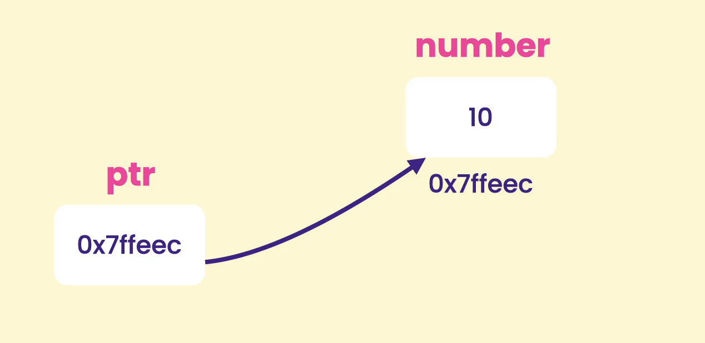
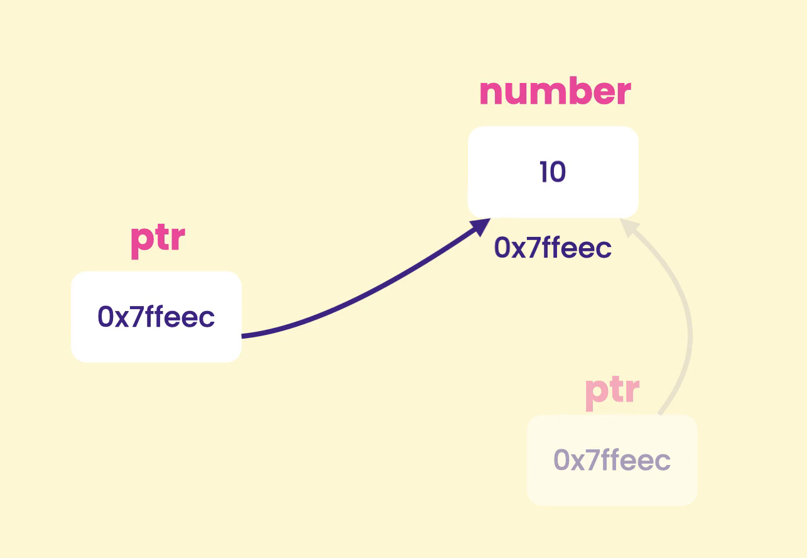
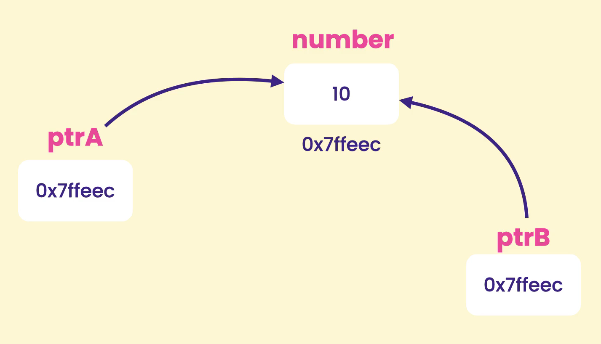

| feature            | feature                               |
| ------------------ | ------------------------------------- |
| 1. [Arrays](#01)   | 4. [Structures and Enumerations](#04) |
| 2. [Pointers](#02) | 5. [Streams and Files](#05)           |
| 3. [Strings](#03)  |                                       |

---

## Arrays<a id="01"></a>

1.  [Introduction](#1)
2.  [Creating and Initializing Arrays](#2)
3.  [Determining the Size of Arrays](#3)
4.  [Copying Arrays](#4)
5.  [Comparing Arrays](#5)
6.  [Passing Arrays to Functions](#6)
7.  [Understanding size_t](#7)
8.  [Unpacking Arrays](#8)
9.  [Searching Arrays](#9)
10. [Sorting Arrays](#10)
11. [Multi-dimensional Arrays](#11)

## Pointers<a id="02"></a>

12. [Introduction](#12)
13. [What is a Pointer](#13)
14. [Declaring and Using Pointers](#14)
15. [Constant Pointers](#15)
16. [Passing Pointers to Functions](#16)
17. [The Relationship Between Arrays and Pointers](#17)
18. [Pointer Arithmetic](#18)
19. [Comparing Pointers](#19)
20. [Dynamic Memory Allocation](#20)
21. [Dynamically Resizing an Array](#21)
22. [Smart Pointers](#22)
23. [Working with Unique Pointers](#23)
24. [Working with Shared Pointers](#24)

## Strings<a id="03"></a>

25. [Introduction](#25)
26. [C Strings](#26)
27. [C++ Strings](#27)
28. [Modifying Strings](#28)
29. [Searching Strings](#29)
30. [Extracting Substrings](#30)
31. [Working with Characters](#31)
32. [String_Numeric Conversion Functions](#32)
33. [Escape Sequences](#33)
34. [Raw Strings](#34)

## Structures and Enumerations<a id="04"></a>

35. [Introduction](#35)
36. [Defining Structures](#36)
37. [Initializing Structures](#37)
38. [Unpacking Structures](#38)
39. [Array of Structures](#39)
40. [Nesting Structures](#40)
41. [Comparing Structures](#41)
42. [Working with Methods](#42)
43. [Operator Overloading](#43)
44. [Structures and Functions](#44)
45. [Pointers to Structures](#45)
46. [Defining Enumerations](#46)
47. [Strongly Typed Enumerations](#47)

## Streams and Files<a id="05"></a>

48. [Introduction](#48)
49. [Understanding Streams](#49)
50. [Writing to Streams](#50)
51. [Reading from Streams](#51)
52. [Handling Input Errors](#52)
53. [File Streams](#53)
54. [Writing to Text Files](#54)
55. [Reading from Text Files](#55)
56. [Writing to Binary Files](#56)
57. [Reading from Binary Files](#57)
58. [Working with File Streams](#58)
59. [String Streams](#59)
60. [Converting Values to Strings](#60)
61. [Parsing Strings](#61)

---

## Arrays

### 1. Introduction<a id="1"></a>

Objectives

- Creating and initializing arrays
- Determining the size of arrays
- Copying and comparing arrays
- Passing arrays to functions
- Searching arrays
- Sorting arrays

### 2. Creating and Initializing Arrays<a id="2"></a>

Array- We use array to store sequence of object in the memory like sequence of number and so on.

```cpp
#include<iostream>
using namespace std;

int main(){

  // size of array
  int numbers[5];

  // how to store value in array using index
  numbers[0] = 10;
  numbers[4] = 20;

  // how to access array value using index
  cout << numbers[4];

  return 0;
}


/* output
20
*/
```

---

2 Example: Approaches

```cpp
#include<iostream>
using namespace std;

int main(){

  // approach 1. How to initialize array using brace initializer
  // note- The first second and third will be initialize and other will be initialize to 0
  int numbers[5] = {10, 20, 30};

  // approach 2. In case we know all the value ahead of time then we dont need to specific the size of array
  // The compiler will figure out the size of array by looking brace initialize value
  int numbersBox[] = {10, 20, 30, 40, 50, 60};

  // how to access array value using index
  cout << numbersBox[5] << endl;
  // print memory address location of array
  cout << numbersBox;

  return 0;
}


/* output
60
0x61fee4
*/

```

### 3. Determining the Size of Arrays<a id="3"></a>

How to use ranged based array

```cpp
#include<iostream>
using namespace std;

int main(){

  int numbers[] = {10, 20, 30, 40, 50, 60};

  // ranged based for loop
  for(int number : numbers){
    cout << number << endl;
  }

  return 0;
}

/* output
10
20
30
40
50
60
*/

```

---

For loop based array

```cpp
#include<iostream>
using namespace std;

int main(){

  int numbers[] = {10, 20, 30, 40, 50, 60};

  // for loop
  for(int i=0; i < size(numbers); i++){
    cout << numbers[i] << endl;
  }

  return 0;
}
```

### 4. Copying Arrays<a id="4"></a>

```cpp
#include<iostream>
using namespace std;

int main(){

  int first[] = {10, 20, 30};
  int second[size(first)];

  // using for loop to copy from first array to second array
  for(int i=0; i < size(first); i++){
    second[i] = first[i];
  }

  // print second array value
  for(int number : second){
    cout << number << endl;
  }

  return 0;

}

```

### 5. Comparing Arrays<a id="5"></a>

```cpp
#include<iostream>
using namespace std;

int main(){

  int first[] = {10, 20, 30};
  int second[] = {10, 20, 30};
  // int second[] = {10, 20, 0};

  bool areEqual = true;

  for(int i = 0; i < size(first); i++){
    if(first[i] != second[i]){
      areEqual = false;
      break;
    }
  }


  cout << boolalpha << areEqual;

  return 0;

}

```

### 6. Passing Arrays to Functions<a id="6"></a>

```cpp
#include<iostream>
using namespace std;

void printNumber(int number[], int size){
  for(int i =0; i < size; i++){
    cout << number[i];
  }
}

int main(){

  int numbers[] = {10, 20, 30};

  // passing array
  printNumber(numbers, size(numbers));

  return 0;

}

```

### 7. Understanding size_t<a id="7"></a>

size_t -
t for type, is a data type define in standard library that is use to represent the size of object

```cpp
#include<iostream>
using namespace std;

int main(){

  int numbers[] = {10, 20, 30};

  cout << sizeof(int) << endl;
  cout << sizeof(size_t) << endl;

  return 0;
}

```

### 8. Unpacking Arrays<a id="8"></a>

```cpp
#include<iostream>
using namespace std;

int main(){

  int values[3] = {10, 20, 30};

  // C++ : structured binding
  // JS : destructuring
  // python : unpacking
  auto [x, y, z] = values;

  cout << x << ", " << y << ", " << z ;

  // OLD WAY or another approach
  // int x = values[0];
  // int y = values[1];
  // int z = values[2];

  return 0;
}

```

### 9. Searching Arrays<a id="9"></a>

### 10. Sorting Arrays<a id="10"></a>

### 11. Multi-dimensional Arrays<a id="11"></a>

## Pointers

### 12. Introduction<a id="12"></a>

Objectives

- what are pointer and why we use them
- Declare and use pointer
- efficiently pass data
- allocate memory dynamically
- problems with pointer
- use smart pointer in modern C++ to avoid pointer problem

### 13. What is a Pointer<a id="13"></a>

Pointer-
A pointer is a special variable that holds the address of another variable in memory

Why use pointer?

- To efficiently pass large object, pass them by reference.
- Dynamic memory allocation, resize array
- Enabling polymorphism

### 14. Declaring and Using Pointers<a id="14"></a>



" & " : address of operator

" \* " : dereferencing operator or indirection operator

```cpp
#include<iostream>
using namespace std;

int main(){

    // every variable has an address
    int number = 10;
    cout << number << endl;

    // how to print memory address of number variable using '&' i.e address of operator
    cout << &number << endl;

    // how to initialize null-pointer
    // a null-pointer is a pointer that doesn't point to anything
    // int* ptr = nullptr;

    // how to declare integer pointer and store address
    int* ptr = &number;

    // how to access data at target memory location, using indirection/de-reference operator
    cout << *ptr << endl;

    // how to print address of pointed variable
    cout << ptr << endl;

    // how to change data at target memory location, using indirection/d-reference operator
    *ptr = 20;

    cout << number;

    return 0;
}


/* output
10
0xd9eabffbb4
10
0xd9eabffbb4
20
*/
```

---

2 Example

```cpp
#include<iostream>
using namespace std;

int main(){

  int x = 10;
  int y = 20;

  int* ptr = &x;  // pointing to x

  *ptr *= 2;  // x = 20

  ptr = &y; // set address to y

  *ptr *= 3;  // y = 60

  return 0;
}

```

---

Way to declare pointer, notice place of \*

```cpp

int number = 10;

✅ preferable
int* ptr = &number;

// confusing with indirection/de-reference operator
int *ptr = &number;
```

### 15. Constant Pointers<a id="15"></a>

Pointe & constant: 3 scenario

- data is constant but pointer is not, so later we can use pointer to point something else
- pointer is constant, so once we declare and initialize the pointer we cannot have it point to something else
- both data and pointer are constant

---

Scene 1: data is constant but pointer is not

```cpp

#include<iostream>
using namespace std;

int main(){

  const int x = 10;

  // constant integer pointer, but pointer is not constant
  const int* ptr = &x;

  int y = 20;

  ptr = &y;

  return 0;
}

```

---

Scene 2: pointer is constant

```cpp
#include<iostream>
using namespace std;

int main(){

  int x = 10;

  // pointer is constant
  int* const ptr = &x;

  return 0;
}

```

---

Scene 3: both data and pointer are constant

```cpp
#include<iostream>
using namespace std;

int main(){

  const int x = 10;

  // How to read the line: we have constant pointer, pointing to constant integer
  const int* const ptr = &x;

  return 0;
}

```

### 16. Passing Pointers to Functions<a id="16"></a>

Pass by value

```cpp
#include <iostream>
using namespace std;

void increasePrice(double price){
    price *= 1.2;
}

int main(){
    double price = 100;

    // pass by value: we pass the copy of variable price
    increasePrice(price);
    cout << price;
    return 0;
}

/* output
100
*/
```

---

1. approach/pattern: new way

```cpp
#include <iostream>
using namespace std;

void increasePrice(double& price){
    price *= 1.2;
}

int main(){
    double price = 100;

    // pass by reference: we pass the reference of variable price,
    // now we can directly access price variable through our function
    increasePrice(price);
    cout << price;
    return 0;
}


/* output
120
*/
```

---

2 approach/pattern: old way

```cpp
#include <iostream>
using namespace std;

// 1.declare parameter as pointer
void increasePrice(double* price){
    //2. indirection operator
    *price *= 1.2;
}

int main(){
    double price = 100;

    //3. address of operator to ask the address of price variable
    increasePrice(&price);
    cout << price;
    return 0;
}

/* output
120
*/
```

### 17. The Relationship Between Arrays and Pointers<a id="17"></a>

```cpp
#include <iostream>
using namespace std;

void printNumbers(int numbers[]){
    numbers[0] = 0;
}

int main(){
    int numbers[] = {10,20,30};
    printNumbers(numbers);
    cout << numbers[0];

    return 0;
}

/* output
0
*/
```

### 18. Pointer Arithmetic<a id="18"></a>

We can only perform two operation on pointer i.e addition and subtraction
NOT multiplication and division

pointer increment

```cpp
#include <iostream>
using namespace std;

int main(){
    int numbers[] = {10,20,30};
    int* ptr = numbers;

    ptr++;
    cout << *ptr;
    return 0;
}


/* output
20
*/
```

---

pointer decrement

```cpp
#include <iostream>
using namespace std;

int main(){
    int numbers[] = {10,20,30};
    int* ptr = numbers;

    ptr--;
    cout << *ptr;
    return 0;
}


/* output
10
*/
```

---

Pointer expression

```cpp
#include <iostream>
using namespace std;

int main(){
    int numbers[] = {10,20,30};
    int* ptr = numbers;
    // dereference the pointer, means access value(increment pointer by one)
    cout << *(ptr + 1);

    // same as above line but using bracket notation
    // cout << ptr[1];
    // cout << numbers[1];
    return 0;
}


/* output
20
*/
```

### 19. Comparing Pointers<a id="19"></a>

```cpp
#include <iostream>
using namespace std;

int main(){
    int x = 20;
    int y = 20;

    int* ptrX = &x;
    int* ptrY = &y;

    // comparing address
    // if(ptrX == ptrY)

    // comparing value
    if(*ptrX == *ptrY)
        cout << "same";

    return 0;
}
```

### 20. Dynamic Memory Allocation<a id="20"></a>

If we declare an array of integer like "int numbers[10];", we are limiting our program to handle maximum of 10 numbers.

Or we can allocate memory to our program at run time on demand this is called dynamic memory allocation

Stack memory:

- variable declared on stack they get automatic clean up.
- once they got out of scope the memory allocated to them, get released automatically.

Heap or free store memory:

- to allocate memory dynamically we use "new" operator/keyword.
- variable declared on heap using "new" operator/keyword, we programmers are responsible for the clean up.
- when we do not release memory from heap, program consume more and more memory eventually our program gonna crash this is called memory leak.
- memory leak: means our program consume more and more memory.
- to de-allocate we use "delete" operator/keyword

---

Allocating array on heap

```cpp
#include <iostream>
using namespace std;

int main(){
    // Stack memory
    // int numbers[1000];


    // Heap memory(free store)
    // allocating array on heap
    int* numbers = new int[10];

    //de allocating array memory from heap
    delete[] numbers;

    // convention: reset pointer
    numbers = nullptr;

    return 0;
}
```

---

Allocating single integer on heap

```cpp
#include <iostream>
using namespace std;

int main(){


    // Stack memory
    // int numbers[1000];

    // Heap memory(free store)
    // allocating single integer on heap
    int* number = new int;

    // de allocating single integer from memory
    delete[] number;

    // convention: reset pointer
    number = nullptr;

    return 0;
}
```

### 21. Dynamically Resizing an Array<a id="21"></a>

```cpp
#include <iostream>
using namespace std;

int main(){

// declaring integer array on heap
int* numbers = new int[5];

// declaring variable on stack
int entries =0;

while(true){
    cout << "Number: ";
    cin >> numbers[entries];

    if(cin.fail()) break;
    entries++;

}

for(int i=0; i<entries; i++)
    cout << numbers[i] << endl;

return 0;
}


/* output
 Number:1
 Number:2
 Number:3
 Number:4
 Number:5
 Number:k
 1
 2
 3
 4
 5
*/
```

---

2 Example

```cpp
#include <iostream>
using namespace std;

int main(){

// declaring integer array on heap
int* numbers = new int[5];

// declaring variable on stack
int entries =0;

while(true){
    cout << "Number: ";
    cin >> numbers[entries];

    if(cin.fail()) break;
    entries++;

    if(entries ==5){
        // Algorithm for dynamic array
        // 1. create a temp array (twice the size)
        int* temp = new int[10];
        // 2. copy all the elements
        for (int i=0; i<entries; i++)
            temp[i] = numbers[i];

        // delete initial array from heap to avoid memory leak
        delete[] numbers;
        // 3. Have "numbers" pointer point to the new array
        numbers = temp;

    }
}

for(int i=0; i<entries; i++)
    cout << numbers[i] << endl;

return 0;
}

/* output
 Number:1
 Number:2
 Number:3
 Number:4
 Number:5
 Number:6
 Number:7
 Number:8
 Number:9
 Number:10
 Number:j
1
2
3
4
5
6
7
8
9
10

*/
```

---

3 Example

```cpp
#include <iostream>
using namespace std;

int main(){
// declaring variable on stack
    int capacity = 5;
    int entries =0;

// declaring integer array on heap
int* numbers = new int[capacity];


while(true){
    cout << "Number: ";
    cin >> numbers[entries];

    if(cin.fail()) break;
    entries++;

    if(entries == capacity){
        // Algorithm for dynamic array
        capacity *= 2;

        // 1. create a temp array (twice the size)
        int* temp = new int[capacity];
        // 2. copy all the elements
        for (int i=0; i<entries; i++)
            temp[i] = numbers[i];

        // delete initial array from heap to avoid memory leak
        delete[] numbers;
        // 3. Have "numbers" pointer point to the new array
        numbers = temp;

    }
}

for(int i=0; i<entries; i++)
    cout << numbers[i] << endl;

delete[] numbers;

return 0;
}


/* output
 Number:1
 Number:2
 Number:3
 Number:4
 Number:5
 Number:6
 Number:7
 Number:8
 Number:9
 Number:10
 Number:11
 Number:12
 Number:13
 Number:14
 Number:15
 Number:16
 Number:17
 Number:p
1
2
3
4
5
6
7
8
9
10
11
12
13
14
15
16
17
*/
```

### 22. Smart Pointers<a id="22"></a>

There are 2 types of smart pointer

- unique pointer
- shared pointer

### 23. Working with Unique Pointers<a id="23"></a>



Unique pointer- is a kind of pointer that owns the piece of memory it points to, we cannot have two unique pointer, pointing to the same memory location

```cpp
#include <iostream>
#include <memory>

using namespace std;

int main(){
    unique_ptr<int> xyzobj(new int);
    cout << xyzobj;

return 0;
}


/* output
0x1fc91371ad0
*/
```

---

```cpp
#include <iostream>
#include <memory>

using namespace std;

int main(){
    unique_ptr<int> xyzobj(new int);

    // dereference and store some value
    *xyzobj = 10;
    cout << *xyzobj;

return 0;
}


/* output
10
*/
```

---

```cpp
#include <iostream>
#include <memory>

using namespace std;

int main(){
    // 1 approach to create unique pointer
    unique_ptr<int> xyzobj(new int);

    // 2 approach to create unique pointer
    unique_ptr<int> y = make_unique<int>();

    // 3 approach to create unique pointer
    auto z = make_unique<int>();


    // dereference and store some value
    *xyzobj = 10;
    cout << *xyzobj;

return 0;
}
```

---

```cpp
#include <iostream>
#include <memory>

using namespace std;

int main(){

    auto numbers = make_unique<int[]>(10);
    unique_ptr<int> y = make_unique<int>();

    numbers[0] = 10;
    cout << numbers[0];

return 0;
}

/* output
10
*/
```

### 24. Working with Shared Pointers<a id="24"></a>

with shared pointer we can have 2 pointer, pointing to same memory location



```cpp
#include <iostream>
#include <memory>

using namespace std;

int main(){

    // 1 approach: create shared pointer
    shared_ptr<int> x(new int);

    // 2 approach: create shared pointer
    shared_ptr<int> y = make_shared<int>();

    // 3 approach: create shared pointer
    auto z = make_shared<int>();


return 0;
}
```

---

```cpp
#include <iostream>
#include <memory>

using namespace std;

int main(){

    auto x = make_shared<int>();

    // dereference and store value
    *x = 10;

    shared_ptr<int> y(x);

    if(x == y)
        cout << "equal";

return 0;
}
```

---

```cpp
#include <iostream>
#include <memory>

using namespace std;

int main(){

    auto x = make_shared<int>();

    // dereference and store value
    *x = 10;

    shared_ptr<int> y(x);


    cout << *y;

return 0;
}
```

## Strings

### 25. Introduction<a id="25"></a>

Objectives

- C strings
- C++ strings
- Modifying strings
- Searching strings
- Extracting substring
- Converting strings to numbers and vice versa

### 26. C Strings<a id="26"></a>

### 27. C++ Strings<a id="27"></a>

```cpp
#include <iostream>

using namespace std;

int main(){
    string name = "Joy";

    // how to modify letter using index
    name[0] = 'R';

    // how to get length of string
    cout << name.length() << endl;

    // how to concatenate string
    name = name + " Smith Peter";
    cout << name << endl;

    // how to copy string in different variable
    string xyzVariable = name;
    cout << xyzVariable << endl;

    // how to compare two string objects
    if(name == xyzVariable)
        cout << "same" << endl;

    // how to check if name start with specific letter
    cout << name.starts_with('R') << endl;

    // how to check if name ends with specific letter
    cout << name.ends_with('r') << endl;

    // how to check if our string is empty
    cout << name.empty() << endl;

    // how to get first character of string
    cout << name.front() << endl;

    // how to get last character of string
    cout << name.back() << endl;

return 0;
}


/* output
3
Roy Smith Peter
Roy Smith Peter
same
1
1
0
R
r
*/
```

### 28. Modifying Strings<a id="28"></a>

[C++ string reference](https://cplusplus.com/reference/string/string/)

```cpp
#include <iostream>

using namespace std;

int main(){
    string name = "Joy";

    // how to append string
    name.append("Smith Peter");
    cout << name << endl;

    // how to insert string at specific position
    name.insert(0,"I am ");
    cout << name << endl;

    // how to erase character from the string
    // erase take 2 args: position where u want to start deleting, character how many u want to delete
    name.erase(0, 7);
    cout << name << endl;

    // how to empty string
    name.clear();
    cout << name << endl;


    // how to replace portion of string
    // replace takes 3 args: position; no. of character; what u want to replace with
    name.replace(0,3, "Toy");
    cout << name << endl;

    return 0;
}


/* output
JoySmith Peter
I am JoySmith Peter
ySmith Peter

Toy

*/
```

### 29. Searching Strings<a id="29"></a>

```cpp
#include <iostream>

using namespace std;

int main(){
    string name = "You are so great";

   // how to get the position of letter at first occurence
   cout << name.find('g') << endl;

    // usage case
    if(name.find('z') == -1)
        cout << "Doesn't exist" << endl;

    // reverse find
    cout << name.rfind('u') << endl;

    return 0;
}


/* output
11
Doesn't exist
2
*/
```

### 30. Extracting Substrings<a id="30"></a>

```cpp
#include <iostream>

using namespace std;

int main(){
    string name = "being smart is better than being dumb";

    // copying quote to new copy variable
    string copy = name.substr();

    // empty name string
    // name = "";
    cout << copy << endl;

    // how to extract substring from string
    copy = name.substr(5);
    cout << copy << endl;


    // how to extract substring from string start-end point
    copy = name.substr(5,7);
    cout << copy << endl;

    return 0;
}


/* output
being smart is better than being dumb
smart is better than being dumb
smart
*/
```

### 31. Working with Characters<a id="31"></a>

### 32. String_Numeric Conversion Functions<a id="32"></a>

### 33. Escape Sequences<a id="33"></a>

### 34. Raw Strings<a id="34"></a>

## Structures and Enumerations

### 35. Introduction<a id="35"></a>

Objectives

- Define structure
- use structures
- operator overloading
- pointers to structure
- enumerations

### 36. Defining Structures<a id="36"></a>

With structure we can define custom data types, In computer science we call it ADT(Abstract data type)

Abstraction: A general model of something, like an abstraction for customer, movie, rental etc.

```cpp
#include <iostream>

using namespace std;

// PascalCase
struct Movie{
    string title;
    int releaseYear;
};

int main(){
    // how to create instance/object
    Movie movie;

    // how to access member using ". (dot)" notation
    movie.title = "Iron man";
    movie.releaseYear= 2008;

    cout << "Title: " << movie.title << endl
         << "Release Year: " << movie.releaseYear;

    return 0;
}

/* output
Title: Iron man
Release Year: 2008
*/
```

### 37. Initializing Structures<a id="37"></a>

```cpp
#include <iostream>

using namespace std;

// How to define structure aka adt(abstract data type)
struct Movie{
    string title ;
    int releaseYear;
};

int main(){
    // how to initialize object
    Movie movie = {"Thor", 2015} ;


    cout << "Title: " << movie.title << endl
         << "Release Year: " << movie.releaseYear;

    return 0;
}


/* output
Title: Thor
Release Year: 2015
*/
```

### 38. Unpacking Structures<a id="38"></a>

```cpp
#include <iostream>

using namespace std;

// How to define structure aka adt(abstract data type)
struct Movie{
    string title ;
    int releaseYear;
    bool isPopular;
};

int main(){
    // how to initialize object
    Movie movie = {"Thor", 2015, true} ;

    // 1 Approach: how to extract data from structure
    // string title = movie.title;
    // int releaseYear = movie.releaseYear;
    // bool isPopular = movie.isPopular;

    // 2 Approach: how to extract data from structure
    // C++: structured binding aka
    // JS: destructuring
    // python: unpacking
    auto [ title, releaseYear, isPopular] {movie};


    cout << "Title: " << title << endl
         << "Release Year: " << releaseYear << endl
         << "is Popular " << title;

    return 0;
}

/* output
Title: Thor
Release Year: 2015
is Popular Thor
*/
```

### 39. Array of Structures<a id="39"></a>

```cpp
#include <iostream>
#include <vector>

using namespace std;

// How to define structure aka adt(abstract data type)
struct Movie{
    string title ;
    int releaseYear;
    bool isPopular;
};

int main(){
    // creating dynamic array
    vector<Movie> movies;

    Movie movie = {"Batman", 2000};

    // 1 approach: how to push in dynamic array by passing movie object
    movies.push_back(movie);

    // 2 approach: how to push in dynamic array by using brace initializer
    movies.push_back({"Spiderman", 2005});
    movies.push_back({"Robocop", 2014});

    // how to access array
    cout << movies[0].title;

    // how to access array using for-each
    for(Movie movie:movies)
        cout << movie.title << endl;

    return 0;
}


/* output
BatmanBatman
Spiderman
Robocop
*/
```

### 40. Nesting Structures<a id="40"></a>

```cpp
#include <iostream>
#include <vector>

using namespace std;

struct Date {
    // putting default value
    short year = 2000;
    short month = 1;
    short day = 1;
};

// How to make nested structure
struct Movie{
    string title ;
    // Date structure is nested inside Movie structure
    Date releaseDate;
    bool isPopular;
};

int main(){
    Movie movie = {"Batman", 2000};

    // how to access nested structure
    cout << movie.releaseDate.year;

    return 0;
}


/* output
2000
*/
```

---

```cpp
#include <iostream>
#include <vector>

using namespace std;

struct Date {
    // putting default value
    short year = 2000;
    short month = 1;
    short day = 1;
};

// How to make nested structure
struct Movie{
    string title ;
    Date releaseDate;
    bool isPopular;
};

int main(){
    // 1 Approach: how to initialize date in 2 steps
    Date date = {2000,6,1};
    Movie movie = {"Batman", date};


    // 2 Approach: how to initialize date in 1 steps using initialization list
    // Movie movie = {"Batman", {2000,6,1}};

    // how to access nested structure
    cout << movie.releaseDate.year;

    return 0;
}


/* output
2000
*/
```

### 41. Comparing Structures<a id="41"></a>

```cpp
#include <iostream>
#include <vector>

using namespace std;

struct Date {
    // putting default value
    short year = 2000;
    short month = 1;
    short day = 1;
};

// How to make nested structure
struct Movie{
    string title ;
    Date releaseDate;
    bool isPopular;
};

int main(){
    // 2 Approach: how to initialize date in 1 steps using initialization list
    Movie movie1 = {
            "Batman",
            {2000,6,1}
    };

    Movie movie2 = {
            "Batman",
            {2000,6,1}
    };


    if(movie1.title == movie2.title &&
        movie1.releaseDate.year ==  movie2.releaseDate.year &&
        movie1.releaseDate.month ==  movie2.releaseDate.month &&
        movie1.releaseDate.day ==  movie2.releaseDate.day
    ){
        cout << "equal";
    }

    return 0;
}

/* output
equal
*/
```

### 42. Working with Methods<a id="42"></a>

```cpp
#include <iostream>
#include <vector>

using namespace std;

struct Date {
    // putting default value
    short year = 2000;
    short month = 1;
    short day = 1;
};

// How to make nested structure
struct Movie{
    string title ;
    Date releaseDate;
    bool isPopular;


    // methods: method is a function that is a part of instance
    bool equals(const Movie& movie){
        return (
                title == movie.title &&
                releaseDate.year ==  movie.releaseDate.year &&
                releaseDate.month ==  movie.releaseDate.month &&
                releaseDate.day ==  movie.releaseDate.day
        );
    }
};

int main(){
    // 2 Approach: how to initialize date in 1 steps using initialization list
    Movie movie1 = {
            "Batman",
            {2000,6,1}
    };

    Movie movie2 = {
            "Batman",
            {2000,6,1}
    };

    if(movie1.equals(movie2))
        cout << "Equal";


    return 0;
}


/* output
equal
*/
```

### 43. Operator Overloading<a id="43"></a>

[C++ operator overloading](https://en.cppreference.com/w/cpp/language/operators)

Approach 1: method inside structure

```cpp
#include <iostream>
#include <vector>

using namespace std;

struct Date {
    // putting default value
    short year = 2000;
    short month = 1;
    short day = 1;
};

// How to make nested structure
struct Movie{
    string title ;
    Date releaseDate;
    bool isPopular;


    // operator overloading
    bool operator==(const Movie& movie) const{
        return (
                title == movie.title &&
                releaseDate.year ==  movie.releaseDate.year &&
                releaseDate.month ==  movie.releaseDate.month &&
                releaseDate.day ==  movie.releaseDate.day
        );
    }
};

int main(){
    // 2 Approach: how to initialize date in 1 steps using initialization list
    Movie movie1 = {
            "Batman",
            {2000,6,1}
    };

    Movie movie2 = {
            "Batman",
            {2000,6,1}
    };

    if(movie1 == movie2)
        cout << "Equal";


    return 0;
}


/* output
equal
*/
```

---

Approach 2: method outside structure

- preferred: because some operator like stream insertion operator can only be implemented outside the structure

- The signature of function is clear, and readability is easy

```cpp
#include <iostream>
#include <vector>

using namespace std;

struct Date {
    // putting default value
    short year = 2000;
    short month = 1;
    short day = 1;
};

// How to make nested structure
struct Movie{
    string title ;
    Date releaseDate;
    bool isPopular;

};

// operator overloading
bool operator==(const Movie& first, const Movie& second) {
    return (
            first.title == second.title &&
            first.releaseDate.year ==  second.releaseDate.year &&
            first.releaseDate.month ==  second.releaseDate.month &&
            first.releaseDate.day ==  second.releaseDate.day
    );
}


int main(){
    // 2 Approach: how to initialize date in 1 steps using initialization list
    Movie movie1 = {
            "Batman",
            {2000,6,1}
    };

    Movie movie2 = {
            "Batman",
            {2000,6,1}
    };

    if(movie1 == movie2)
        cout << "Equal";


    return 0;
}


/* output
equal
*/
```

---

Another example with stream insertion operator

```cpp
#include <iostream>
#include <vector>

using namespace std;

struct Date {
    // putting default value
    short year = 2000;
    short month = 1;
    short day = 1;
};

// How to make nested structure
struct Movie{
    string title ;
    Date releaseDate;
    bool isPopular;

};

// operator overloading
bool operator==(const Movie& first, const Movie& second) {
    return (
            first.title == second.title &&
            first.releaseDate.year ==  second.releaseDate.year &&
            first.releaseDate.month ==  second.releaseDate.month &&
            first.releaseDate.day ==  second.releaseDate.day
    );
}

ostream& operator<<(ostream& stream, const Movie&  movie){
    stream << movie.title;
    return stream;
}

int main(){
    // 2 Approach: how to initialize date in 1 steps using initialization list
    Movie movie1 = {
            "Batman",
            {2000,6,1}
    };

    Movie movie2 = {
            "Batman",
            {2000,6,1}
    };

    cout << movie1;

    return 0;
}

/* output
Batman
*/
```

### 44. Structures and Functions<a id="44"></a>

```cpp
#include <iostream>

using namespace std;

struct Date {
    short year = 2000;
    short month = 1;
    short day = 1;
};

struct Movie{
    string title ;
    Date releaseDate;
    bool isPopular;

};

bool operator==(const Movie& first, const Movie& second) {
    return (
            first.title == second.title &&
            first.releaseDate.year ==  second.releaseDate.year &&
            first.releaseDate.month ==  second.releaseDate.month &&
            first.releaseDate.day ==  second.releaseDate.day
    );
}

ostream& operator<<(ostream& stream, Movie& movie){
    stream << movie.title;
    return stream;
}


//Movie getMovie(){
//    Movie movie = {"Avenger", 2009};
//    return movie;
//}
Movie getMovie(){
    return {"Avenger", 2009};
}

void showMovie(Movie& movie){
    cout << movie.title;
}

int main(){
    Movie movie = getMovie();
    showMovie(movie);

    return 0;
}


/* output
Avenger
*/
```

### 45. Pointers to Structures<a id="45"></a>

```cpp
#include <iostream>

using namespace std;

struct Date {
    short year = 2000;
    short month = 1;
    short day = 1;
};

struct Movie{
    string title ;
    Date releaseDate;
    bool isPopular;

};

bool operator==(const Movie& first, const Movie& second) {
    return (
            first.title == second.title &&
            first.releaseDate.year ==  second.releaseDate.year &&
            first.releaseDate.month ==  second.releaseDate.month &&
            first.releaseDate.day ==  second.releaseDate.day
    );
}

ostream& operator<<(ostream& stream, Movie& movie){
    stream << movie.title;
    return stream;
}


//Movie getMovie(){
//    Movie movie = {"Avenger", 2009};
//    return movie;
//}
Movie getMovie(){
    return {"Avenger", 2009};
}

void showMovie(Movie* movie){
    // cout << (*movie).title;
    // using structure pointer operator
    cout << movie->title;

}

int main(){
    Movie movie = getMovie();
    showMovie(&movie);

    return 0;
}


/* output
Avenger
*/
```

### 46. Defining Enumerations<a id="46"></a>

```cpp
#include <iostream>

using namespace std;

// how to create enumeration
// the compiler will automatically initialize numeric value like 0, 1, 2
//enum Action{
//    List,
//    Add,
//    Update
//};

// how to explicit assign numeric value to enum
enum Action{
    List = 1,
    Add = 2,
    Update =3
};

int main(){

    cout <<
        "1: List invoices" << endl <<
        "2: Add invoices" << endl <<
        "3: Update invoices" << endl <<
        "Select: ";

    int input;
    cin >> input;

    if(input == Action::List){
        cout << "List invoices";
    }

    return 0;
}


/* output
1: List invoices
2: Add invoices
3: Update invoices
Select:1
 List invoices
*/
```

### 47. Strongly Typed Enumerations<a id="47"></a>

```cpp
#include <iostream>

using namespace std;

// how to create strongly type enumeration to prevent name collision
enum class Action{
    List = 1,
    Add = 2,
    Update =3
};

enum class Operation{
    List = 1,
    Add = 2,
    Update =3
};

int main(){

    cout <<
        "1: List invoices" << endl <<
        "2: Add invoices" << endl <<
        "3: Update invoices" << endl <<
        "Select: ";

    int input;
    cin >> input;

    if(input == static_cast<int>(Action::List)){
        cout << "List invoices";
    }

    return 0;
}

/* output
1: List invoices
2: Add invoices
3: Update invoices
Select:1
 List invoices
*/
```

## Streams and Files

### 48. Introduction<a id="48"></a>

Objectives

- what streams are
- standard input/output stream
- read from and write to files
- difference between binary and text files
- convert a value to a string
- parse a string to extract values

### 49. Understanding Streams<a id="49"></a>

In read world we read data from Terminal, files, network

Different types of streams

- istream (input stream)
- ostream (output stream)
- ifstream (input file stream)
- ofstream (output file stream)
- istringstream
- ostringstream

[C++ ios (input output stream)](https://cplusplus.com/reference/ios/)

all stream classes inherit functionality from ios_base class

### 50. Writing to Streams<a id="50"></a>

[C++ cout](https://cplusplus.com/reference/iostream/cout/)

- cout is an object and the type of this object is ostream
- so cout is an instance of ostream class

### 51. Reading from Streams<a id="51"></a>

with buffer

```cpp
#include <iostream>

using namespace std;

int main(){
    // Buffer: temporary storage
    // [10, 20]
    cout << "First: ";
    int first;
    cin >> first;

    cout << "Second: ";
    int second;
    cin >> second;

    cout << "You entered " << first << "and " << second;
    return 0;
}


/* output
First:10 20
Second: You entered 10and 20
Process finished with exit code 0
*/
```

---

```cpp
#include <iostream>

using namespace std;

int main(){
    // Buffer: temporary storage
    // [10, 20]
    cout << "First: ";
    int first;
    cin >> first;
    cin.ignore(10, '\n');

    // cin.ignore(numeric_limits<streamsize>::max(), '\n');

    cout << "Second: ";
    int second;
    cin >> second;

    cout << "You entered " << first << "and " << second;
    return 0;
}


/* output
First:10 20
Second:30
You entered 10and 30
*/
```

### 52. Handling Input Errors<a id="52"></a>

```cpp
#include <iostream>

using namespace std;

int main(){
    int first;

    while(true){
        cout << "First: ";

        cin >> first;

        if(cin.fail()){
            cout << "Enter a valid number!" << endl;
            cin.clear();
            cin.ignore(10, '\n');
            // cin.ignore(numeric_limits<streamsize>::max(), '\n');
        }
        else break;
    }


    cout << "Second: ";
    int second;
    cin >> second;

    cout << "You entered " << first << "and " << second;
    return 0;
}

/* output
First:k
 Enter a valid number!
First:t
 Enter a valid number!
First:10
 Second:30
 You entered 10and 30
*/

```

### 53. File Streams<a id="53"></a>

These are classes

- ifstream (input file stream): To read data from a file
- ofstream (output file stream): To write data on a file
- fstream (file stream): read/write data on file, combine functionality of both the above classes

### 54. Writing to Text Files<a id="54"></a>

```cpp
#include <iostream>
#include <fstream>

// input output manipulator
#include <iomanip>

using namespace std;

int main(){

    ofstream file;

    file.open("data.txt");
    if(file.is_open()){
        file << setw(20) << "Hello" << setw(20) << "World" << endl;
        file.close();
    }

    return 0;
}
```

---

Creating a csv file

```cpp
#include <iostream>
#include <fstream>

// input output manipulator
#include <iomanip>

using namespace std;

int main(){

    ofstream file;

    file.open("data.csv");
    if(file.is_open()){

        // CSV: comma separated value
        // file << "id,title,year" << endl;
        // file << "1,iron man,2008" << endl;
        // file << "2,Thor,2012" << endl;
        // file << "3,Spider man,2001" << endl;

        file << "id,title,year\n"
             << "1,iron man,2008\n"
             << "2,Thor,2012\n"
             << "3,Spider man,2001\n" ;

        file.close();
    }

    return 0;
}
```

### 55. Reading from Text Files<a id="55"></a>

```cpp
#include <iostream>
#include <fstream>


using namespace std;

int main(){

    ifstream  file;

    file.open("data.csv");

    if(file.is_open()){
        string str;
        getline(file, str);
        while (!file.eof()){
            getline(file,str);
            cout << str << endl;
        }
        file.close();
    }

    return 0;
}

/* output
1,iron man,2008
2,Thor,2012
3,Spider man,2001
*/

```

---

Extract data from file

```cpp
#include <iostream>
#include <fstream>


using namespace std;

int main(){

    ifstream  file;

    file.open("data.csv");

    if(file.is_open()){
        string str;
        getline(file, str);
        while (!file.eof()){
            getline(file,str, ',');
            cout << str << endl;
        }
        file.close();
    }

    return 0;
}

/* output
1
iron man
2008
2
Thor
2012
3
Spider man
2001
*/

```

---

🔴 code not working

```cpp
#include <iostream>
#include <fstream>

using namespace std;

struct Movie {
    int id;
    string title;
    int year;
};

int main(){

    ifstream  file;

    file.open("data.csv");

    if(file.is_open()){
        string str;
        getline(file, str);

        while (!file.eof()){
            getline(file,str, ',');
            if(str.empty()) continue;

            Movie movie;
            movie.id = stoi(str);

            getline(file,str, ',');
            movie.title = str;

            getline(file,str , ',');
            movie.year = stoi(str);

            cout << movie.title << endl;
        }
        file.close();
    }

    return 0;
}
```

### 56. Writing to Binary Files<a id="56"></a>

There are 2 ways to store data on file

- text files
- binary files (images, audio, pdf, etc), these binary files are for machine they are not human readable.

storing data in text file, check size of file

```cpp
#include <iostream>
#include <fstream>

using namespace std;


int main(){

    int numbers[] = {1'000'000, 2'000'000,3'000'000};
    ofstream file("numbers.txt");
    if(file.is_open()){
        for(auto number:numbers)
            file << number << endl;
        file.close();
    }

    return 0;
}
```

---

storing data in binary file, check size of file

```cpp
#include <iostream>
#include <fstream>

using namespace std;


int main(){

    int numbers[] = {1'000'000, 2'000'000,3'000'000};

    // ofstream file("numbers.bin");
    ofstream file("numbers.dat", ios::binary);

    if(file.is_open()){
        file.write(reinterpret_cast<char*>(&numbers), sizeof(numbers));
        file.close();
    }

    return 0;
}
```

### 57. Reading from Binary Files<a id="57"></a>

```cpp
#include <iostream>
#include <fstream>

using namespace std;


int main(){

    int numbers[3];

    // ofstream file("numbers.bin");
    ifstream file("numbers.dat", ios::binary);

    if(file.is_open()){
        int number;

        while(file.read(reinterpret_cast<char*>(&number), sizeof(number))){
            cout << number;
        }

        file.close();
    }

    return 0;
}

/* output
100000020000003000000
*/
```

### 58. Working with File Streams<a id="58"></a>

```cpp
#include <iostream>
#include <fstream>

using namespace std;


int main(){

    fstream file;

    file.open("file.txt", ios::in | ios::out |ios::app | ios::binary);

    if (file.is_open()){
        file.close();
    }

    return 0;
}
```

### 59. String Streams<a id="59"></a>

In c++ std library we have 3 classes to work with string

- istringstream: for reading string
- ostringstream: for writing string
- stringstream: for reading/writing string

### 60. Converting Values to Strings<a id="60"></a>

```cpp
#include <iostream>
#include <sstream>
#include <iomanip>

using namespace std;


int main(){
    double number = 12.34;
    stringstream stream;
    stream << fixed << setprecision(2) << number;
    string str = stream.str();
    // string str = to_string(number);
    cout << str;

    return 0;
}

/* output
12.34
*/
```

### 61. Parsing Strings<a id="61"></a>

```cpp
#include <iostream>
#include <sstream>

using namespace std;


int main(){
    string str = "10 20";
    stringstream stream;
    stream.str(str);

    int first;
    stream >> first;

    int second;
    stream >> second;

    cout << first + second;

    return 0;
}

/* output
30
*/
```

### 62. Summary<a id="62"></a>

Streams- Terms

- Binary files
- Buffer
- File streams
- Input streams
- Output streams
- StreamsString
- streams
- Text files

---

##### Summary

- A stream is an abstraction for a data source or destination. Using streams, we can read data or write it to a variety of places (eg terminal, files, network, etc) in the same way.

- In the C++ STL, we have many stream classes for different purposes. All these classes inherit their functionality from ios_base.

- A buffer is a temporary storage in memory used for reading or writing data to streams.

- If an error occurs while reading data from a stream, the invalid data stays in the buffer and will be used for subsequent reads. In such situations, first we have to put the stream into a clean state using the clear() method. Then, we should clear the data in the buffer using the ignore() method.

- In the C++ STL, we have three stream classes for working with files. (ifstream for reading from files, ofstream for writing to files, and fstream for reading and writing to files).

- Binary files store data the same way it is stored in memory. They are more efficient for storing large amount of numeric data but they’re not human readable.

- Using string streams we can convert data to a string or vice versa.
