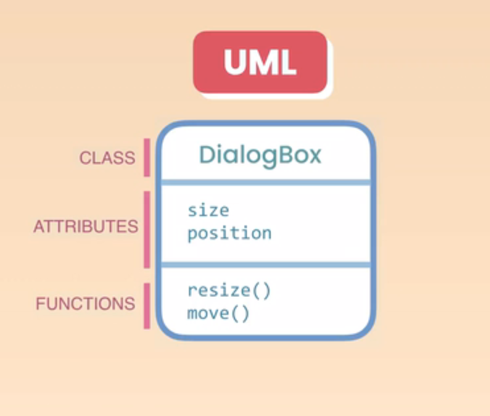
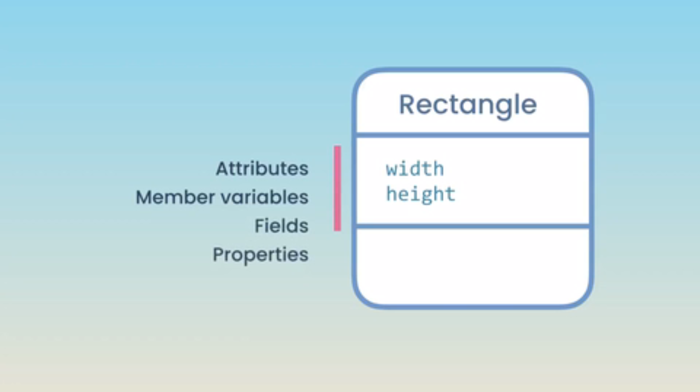
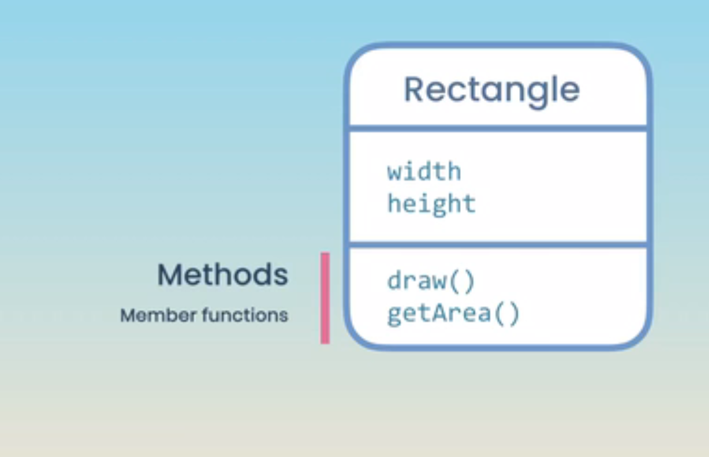

| feature                                | feature              |
| -------------------------------------- | -------------------- |
| 1. [Classes](#01)                      | 4. [Exceptions](#04) |
| 2. [Operator Overloading](#02)         | 5. [Templates](#05)  |
| 3. [Inheritance and Polymorphism](#03) |                      |

## Classes

1.  [Introduction](#1)
2.  [An Introduction to Object-oriented Programming](#2)
3.  [Defining a Class](#3)
4.  [Creating Objects](#4)
5.  [Access Modifiers](#5)
6.  [Getters and Setters](#6)
7.  [Constructors](#7)
8.  [Member Initializer List](#8)
9.  [The Default Constructor](#9)
10. [Using the Explicit Keyword](#10)
11. [Constructor Delegation](#11)
12. [The Copy Constructor](#12)
13. [The Destructor](#13)
14. [Static Members](#14)
15. [Constant Objects and Functions](#15)
16. [Pointer to Objects](#16)
17. [Array of Objects](#17)

## Operator Overloading

18. [Introduction](#18)
19. [Overloading the Equality Operator](#19)
20. [Overloading the Comparison Operators](#20)
21. [Overloading the Spaceship Operator](#21)
22. [Overloading the Stream Insertion Operator](#22)
23. [Overloading the Stream Extraction Operator](#23)
24. [Friends of Classes](#24)
25. [Overloading the Arithmetic Operators](#25)
26. [Overloading Compound Assignment Operators](#26)
27. [Overloading the Assignment Operator](#27)
28. [Overloading Unary Operators](#28)
29. [Overloading the Subscript Operator](#29)
30. [Overloading the Indirection Operator](#30)
31. [Overloading Type Conversions](#31)
32. [Inline Functions](#32)

## Inheritance and Polymorphism

33. [Introduction](#33)
34. [Inheritance](#34)
35. [Protected Members](#35)
36. [Constructors and Inheritance](#36)
37. [Destructors and Inheritance](#37)
38. [Conversion between Base and Derived Classes](#38)
39. [Overriding Methods](#39)
40. [Polymorphism](#40)
41. [Polymorphic Collections](#41)
42. [Virtual Destructors](#42)
43. [Abstract Classes](#43)
44. [Final Classes and Methods](#44)
45. [Deep Inheritance Hierarchies](#45)
46. [Multiple Inheritance](#46)

## Exceptions

47. [Introduction](#47)
48. [What are Exceptions](#48)
49. [Throwing an Exception](#49)
50. [Catching an Exception](#50)
51. [Catching Multiple Exceptions](#51)
52. [Where to Catch Exceptions](#52)
53. [Rethrowing an Exception](#53)
54. [Creating Custom Exceptions](#54)

## Templates

55. [Introduction](#55)
56. [Defining a Function Template](#56)
57. [Explicit Type Arguments](#57)
58. [Templates with Multiple Parameters](#58)
59. [Defining a Class Template](#59)
60. [A More Complex Class Template](#60)

---

## Classes

### 1. Introduction

### 2. An Introduction to Object-oriented Programming

Programming paradigm or style of programming

Programming paradigm

1. Procedural
1. Functional (popular)
1. Object oriented (popular)
1. event driven

| Functional            | Object oriented    |
| --------------------- | ------------------ |
| Centered on functions | Centered on object |
| C                     | C++                |

Which one to use?
A wise software engineer uses the right tools for the right job.
depend on your requirement

---

Object:

- A software entity that has attributes(properties) and functions(methods)

 

> **Dialog box**

Attributes

- size
- position on screen

Functions

- show()
- hide()
- resize()
- move()
- maximize()
- minimize()

---

> **Video player**

Attributes

- size
- currentPosition
- playbackSpeed

Functions

- play()
- pause()
- stop()

---

Class:
 

- A blueprint or recipe for creating objects
- With class we are defining new data type, we can also do that with structure

| Structure                                     | Classes                                              |
| --------------------------------------------- | ---------------------------------------------------- |
| Data                                          | Data + Behavior                                      |
| The structure are simple data container       | Classes for creating object that can do things       |
| structure are more about data                 | Classes are more about data & functionality together |
| Structure member are always public by default | Classes member are always private by default         |

---

Encapsulation:
Combining the data and functions that operate on the data into one unit.

 

 

### 3. Defining a Class

### 4. Creating Objects

### 5. Access Modifiers

### 6. Getters and Setters

### 7. Constructors

### 8. Member Initializer List

### 9. The Default Constructor

### 10. Using the Explicit Keyword

### 11. Constructor Delegation

### 12. The Copy Constructor

### 13. The Destructor

### 14. Static Members

### 15. Constant Objects and Functions

### 16. Pointer to Objects

### 17. Array of Objects

## Operator Overloading

### 18. Introduction

### 19. Overloading the Equality Operator

### 20. Overloading the Comparison Operators

### 21. Overloading the Spaceship Operator

### 22. Overloading the Stream Insertion Operator

### 23. Overloading the Stream Extraction Operator

### 24. Friends of Classes

### 25. Overloading the Arithmetic Operators

### 26. Overloading Compound Assignment Operators

### 27. Overloading the Assignment Operator

### 28. Overloading Unary Operators

### 29. Overloading the Subscript Operator

### 30. Overloading the Indirection Operator

### 31. Overloading Type Conversions

### 32. Inline Functions

## Inheritance and Polymorphism

### 33. Introduction

### 34. Inheritance

### 35. Protected Members

### 36. Constructors and Inheritance

### 37. Destructors and Inheritance

### 38. Conversion between Base and Derived Classes

### 39. Overriding Methods

### 40. Polymorphism

### 41. Polymorphic Collections

### 42. Virtual Destructors

### 43. Abstract Classes

### 44. Final Classes and Methods

### 45. Deep Inheritance Hierarchies

### 46. Multiple Inheritance

## Exceptions

### 47. Introduction

### 48. What are Exceptions

### 49. Throwing an Exception

### 50. Catching an Exception

### 51. Catching Multiple Exceptions

### 52. Where to Catch Exceptions

### 53. Rethrowing an Exception

### 54. Creating Custom Exceptions

## Templates

### 55. Introduction

### 56. Defining a Function Template

### 57. Explicit Type Arguments

### 58. Templates with Multiple Parameters

### 59. Defining a Class Template

### 60. A More Complex Class Template
