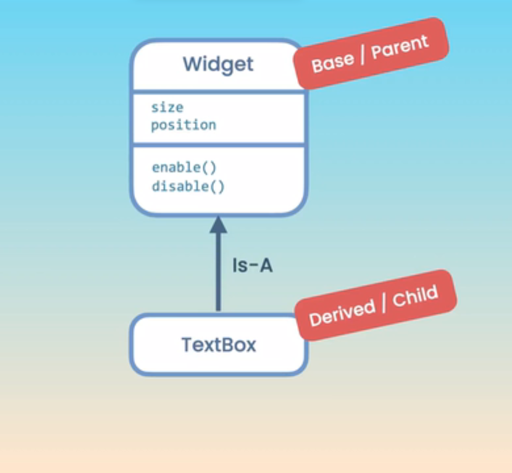

| feature                                | feature              |
| -------------------------------------- | -------------------- |
| 1. [Classes](#01)                      | 4. [Exceptions](#04) |
| 2. [Operator Overloading](#02)         | 5. [Templates](#05)  |
| 3. [Inheritance and Polymorphism](#03) |                      |

## Classes<a id="01"></a>

1.  [Introduction](#1)
2.  [An Introduction to Object-oriented Programming](#2)
3.  [Defining a Class](#3)
4.  [Creating Objects](#4)
5.  [Access Modifiers](#5)
6.  [Getters and Setters](#6)
7.  [Constructors](#7)
8.  [Member Initializer List](#8)
9.  [The Default Constructor](#9)
10. [Using the Explicit Keyword](#10)
11. [Constructor Delegation](#11)
12. [The Copy Constructor](#12)
13. [The Destructor](#13)
14. [Static Members](#14)
15. [Constant Objects and Functions](#15)
16. [Pointer to Objects](#16)
17. [Array of Objects](#17)

## Operator Overloading<a id="02"></a>

18. [Introduction](#18)
19. [Overloading the Equality Operator](#19)
20. [Overloading the Comparison Operators](#20)
21. [Overloading the Spaceship Operator](#21)
22. [Overloading the Stream Insertion Operator](#22)
23. [Overloading the Stream Extraction Operator](#23)
24. [Friends of Classes](#24)
25. [Overloading the Arithmetic Operators](#25)
26. [Overloading Compound Assignment Operators](#26)
27. [Overloading the Assignment Operator](#27)
28. [Overloading Unary Operators](#28)
29. [Overloading the Subscript Operator](#29)
30. [Overloading the Indirection Operator](#30)
31. [Overloading Type Conversions](#31)
32. [Inline Functions](#32)

## Inheritance and Polymorphism<a id="03"></a>

33. [Introduction](#33)
34. [Inheritance](#34)
35. [Protected Members](#35)
36. [Constructors and Inheritance](#36)
37. [Destructors and Inheritance](#37)
38. [Conversion between Base and Derived Classes](#38)
39. [Overriding Methods](#39)
40. [Polymorphism](#40)
41. [Polymorphic Collections](#41)
42. [Virtual Destructors](#42)
43. [Abstract Classes](#43)
44. [Final Classes and Methods](#44)
45. [Deep Inheritance Hierarchies](#45)
46. [Multiple Inheritance](#46)

## Exceptions<a id="04"></a>

47. [Introduction](#47)
48. [What are Exceptions](#48)
49. [Throwing an Exception](#49)
50. [Catching an Exception](#50)
51. [Catching Multiple Exceptions](#51)
52. [Where to Catch Exceptions](#52)
53. [Rethrowing an Exception](#53)
54. [Creating Custom Exceptions](#54)

## Templates<a id="05"></a>

55. [Introduction](#55)
56. [Defining a Function Template](#56)
57. [Explicit Type Arguments](#57)
58. [Templates with Multiple Parameters](#58)
59. [Defining a Class Template](#59)
60. [A More Complex Class Template](#60)

---

## Classes

### 1. Introduction<a id="1"></a>

### 2. An Introduction to Object-oriented Programming<a id="2"></a>

Programming paradigm or style of programming

Programming paradigm

1. Procedural
1. Functional (popular)
1. Object oriented (popular)
1. event driven

| Functional            | Object oriented    |
| --------------------- | ------------------ |
| Centered on functions | Centered on object |
| C                     | C++                |

Which one to use?
A wise software engineer uses the right tools for the right job.
depend on your requirement

<br>

Object:

- A software entity that has attributes(properties) and functions(methods)

<br>

##### **Dialog box**


Attributes

- size
- position on screen

Functions

- show()
- hide()
- resize()
- move()
- maximize()
- minimize()

<br>

##### **Video player**


Attributes

- size
- currentPosition
- playbackSpeed

Functions

- play()
- pause()
- stop()

<br>

##### Other examples

- storing and retrieving data
- sending email and notifications
- Performing computations

---

Class:
<br>


- A blueprint or recipe for creating objects
- With class we are defining new data type, we can also do that with structure

| Structure                                     | Classes                                              |
| --------------------------------------------- | ---------------------------------------------------- |
| Data                                          | Data + Behavior                                      |
| The structure are simple data container       | Classes for creating object that can do things       |
| structure are more about data                 | Classes are more about data & functionality together |
| Structure member are always public by default | Classes member are always private by default         |

---

Encapsulation:
Combining the data and functions that operate on the data into one unit.

<br>


<br>


### 3. Defining a Class<a id="3"></a>

- create a new file name it "Rectangle.h" for class declaration

```cpp
class Rectangle{
  public:
  // member variable
  int width;
  int height;

  // member function
  void draw();
  int getArea();
};
```

---

- create a new file name it "Rectangle.cpp" for class definition/implementation

```cpp
#include<iostream>
#include "Rectangle.h"

using namespace std;

void Rectangle::draw(){
  cout << "Drawing rectangle" << endl;
  cout << "Dimensions: " << width << " " << height << endl;
}

int Rectangle::getArea(){
  return width * height;
}
```

### 4. Creating Objects<a id="4"></a>

```cpp
#include<iostream>
#include "Rectangle.h"
using namespace std;

int main(){
  // How to create instance of Rectangle class aka object
  Rectangle rectangle;

  // How to access the member of this object using "." dot operator
  rectangle.width = 10;
  rectangle.height = 20;

  cout << rectangle.getArea();

  return 0;
}


/* output
200
*/
```

- Open terminal and type cmd manually

```sh
// to compile
g++ main.cpp Rectangle.cpp -o run.exe

// to run
./run
```

---

- The reason we have separation, or the reason we have two files per class, is to reduce compilation time
- If we create a second rectangle object, that object is going to be an independent instance in the memory

```cpp
#include<iostream>
#include "Rectangle.h"
using namespace std;

int main(){
 Rectangle first;
 Rectangle second;

  // print memory address of first object
  cout << &first << endl;
  cout << &second << endl;
  return 0;

/* output
0x61ff08
0x61ff00
*/

}
```

### 5. Access Modifiers<a id="5"></a>

Principle: Data Hiding
A class should hide its internal data from the outside code and provide **functions** for accessing the data.

### 6. Getters and Setters<a id="6"></a>

- Create Rectangle.h file, and write declaration

```cpp
class Rectangle{
private:
    int width;
    int height;

public:
    void draw();
    int getArea();

    // Getter (accessor)
    int getWidth();

    //Setter (mutator)
    void setWidth(int width);


    // Getter (accessor)
    int getHeight() const;

    // Setter (mutator)
    void setHeight(int height);
};

```

---

- create Rectangle.cpp file and write implementation

```cpp
#include <iostream>
#include "Rectangle.h"

using namespace std;

void Rectangle::draw() {
    cout << "Drawing a rectangle" << endl;
    cout << "Dimensions: " << width << " " << height << endl;
}

int Rectangle::getArea() {
    return width * height;
}

int Rectangle::getWidth() {
    return width;
}

void Rectangle::setWidth(int width) {
    // validate width
    if(width <0)
        throw invalid_argument("width");

    (*this).width = width;
}

int Rectangle::getHeight() const {
    return height;
}

void Rectangle::setHeight(int height){
    this->height = height;
}
```

---

- In main.cpp

```cpp
#include<iostream>
#include "Rectangle.h"

using namespace std;

int main(){

Rectangle rectangle;
rectangle.setWidth(-1);
  return 0;
}


/* output
terminate called after throwing an instance of 'std::invalid_argument'
  what():  width

*/

```

### 7. Constructors<a id="7"></a>

A constructor is a special function inside a class, that is used to initialize object.  
A constructor function has no return type i.e void, int, bool, etc, and has same name as class

- In Rectangle.h, declare constructor function

```cpp
class Rectangle{
private:
    int width;
    int height;

public:
  // How to declare constructor function
    Rectangle(int width, int height);

    void draw();
    int getArea();

    // Getter (accessor)
    int getWidth();

    //Setter (mutator)
    void setWidth(int width);


    // Getter (accessor)
    int getHeight() const;

    // Setter (mutator)
    void setHeight(int height);
};

```

---

- In Rectangle.cpp, write implementation of constructor function

```cpp
#include <iostream>
#include "Rectangle.h"

using namespace std;

void Rectangle::draw() {
    cout << "Drawing a rectangle" << endl;
    cout << "Dimensions: " << width << " " << height << endl;
}

int Rectangle::getArea() {
    return width * height;
}

int Rectangle::getWidth() {
    return width;
}

void Rectangle::setWidth(int width) {
    // validate width
    if(width <0)
        throw invalid_argument("width");

    (*this).width = width;
}

int Rectangle::getHeight() const {
    return height;
}

void Rectangle::setHeight(int height){
    this->height = height;
}

// constructor function implementation/definition
Rectangle::Rectangle(int width, int height) {
    cout << "Constructing  a Rectangle" << endl;

    // initialize constructor using getter and setter so we can validate value.
    setWidth(width);
    setHeight(height);
}
```

---

- In main.cpp,

```cpp
#include<iostream>
#include "Rectangle.h"

using namespace std;

int main(){
// approach1:  calling constructor function
Rectangle rectangle(10, 20);

// approach2:  calling constructor function modern way in C++
// Rectangle rectangle{10, 20};


cout << rectangle.getWidth();
  return 0;
}


/* output
Constructing  a Rectangle
10
*/
```

note:
if we pass -1 value in width & height setter will validate and throw error. This is the benefit of initializing object with setters.

### 8. Member Initializer List<a id="8"></a>

Another way to initialize member variable in constructor function

- Rectangle.h same

```cpp
class Rectangle{
private:
    int width;
    int height;

public:
    Rectangle(int width, int height);

    void draw();
    int getArea();

    // Getter (accessor)
    int getWidth();

    //Setter (mutator)
    void setWidth(int width);

    // Getter (accessor)
    int getHeight() const;

    // Setter (mutator)
    void setHeight(int height);
};

```

---

- In Rectangle.cpp, initialize constructor using member initializer list

```cpp

#include <iostream>
#include "Rectangle.h"

using namespace std;

void Rectangle::draw() {
    cout << "Drawing a rectangle" << endl;
    cout << "Dimensions: " << width << " " << height << endl;
}

int Rectangle::getArea() {
    return width * height;
}

int Rectangle::getWidth() {
    return width;
}

void Rectangle::setWidth(int width) {
    // validate width
    if(width <0)
        throw invalid_argument("width");

    (*this).width = width;
}

int Rectangle::getHeight() const {
    return height;
}

void Rectangle::setHeight(int height){
    this->height = height;
}

//approach1: using () syntax
Rectangle::Rectangle(int width, int height) : width(width), height(height) {
  // no data validation good for simple initialization
}

//approach2: using {} syntax in modern c++
//Rectangle::Rectangle(int width, int height) : width{width}, height{height} {
// }

```

---

- In main.cpp, same

```cpp
#include<iostream>
#include "Rectangle.h"

using namespace std;

int main(){

Rectangle rectangle(10, 20);

cout << rectangle.getWidth();
  return 0;
}
```

### 9. The Default Constructor<a id="9"></a>

- A default constructor is a constructor function, with no parameter
- Just like function we can overload constructor with different signature
- The C++ compiler automatically generate default constructor for every class, unless we provide constructor
- In Rectangle.h, declaring default constructor

```cpp
class Rectangle{
private:
    int width;
    int height;

public:
    // declaring default constructor
    Rectangle();

    Rectangle(int width, int height);

    void draw();
    int getArea();

    // Getter (accessor)
    int getWidth();

    //Setter (mutator)
    void setWidth(int width);

    // Getter (accessor)
    int getHeight() const;

    // Setter (mutator)
    void setHeight(int height);
};

```

---

- In Rectangle.cpp, implementing/defining default constructor

```cpp
#include <iostream>
#include "Rectangle.h"

using namespace std;

void Rectangle::draw() {
    cout << "Drawing a rectangle" << endl;
    cout << "Dimensions: " << width << " " << height << endl;
}

int Rectangle::getArea() {
    return width * height;
}

int Rectangle::getWidth() {
    return width;
}

void Rectangle::setWidth(int width) {
    // validate width
    if(width <0)
        throw invalid_argument("width");

    (*this).width = width;
}

int Rectangle::getHeight() const {
    return height;
}

void Rectangle::setHeight(int height){
    this->height = height;
}

Rectangle::Rectangle(int width, int height) {
    cout << "Constructing  a Rectangle" << endl;
    // initialize constructor using getter and setter so we can validate value.
    setWidth(width);
    setHeight(height);
}

// approach 1: how to define/implement default constructor
Rectangle::Rectangle() {
    //empty
}


```

---

- In main.cpp

```cpp
#include<iostream>
#include "Rectangle.h"

using namespace std;

int main(){

// how to call default constructor
Rectangle rectangle;

cout << rectangle.getWidth();
  return 0;
}
```

### Another way to create default constructor

- In Rectangle.h, define default constructor using **default** keyword

```cpp
class Rectangle{
private:
    int width;
    int height;

public:
    // How to define default constructor using default keyword, modern way
    Rectangle() = default

    Rectangle(int width, int height);

    void draw();
    int getArea();

    // Getter (accessor)
    int getWidth();

    //Setter (mutator)
    void setWidth(int width);


    // Getter (accessor)
    int getHeight() const;

    // Setter (mutator)
    void setHeight(int height);
};

```

---

- In Rectangle.cpp, comment/disable approach 1 to create default constructor

```cpp
#include <iostream>
#include "Rectangle.h"

using namespace std;

void Rectangle::draw() {
    cout << "Drawing a rectangle" << endl;
    cout << "Dimensions: " << width << " " << height << endl;
}

int Rectangle::getArea() {
    return width * height;
}

int Rectangle::getWidth() {
    return width;
}

void Rectangle::setWidth(int width) {
    // validate width
    if(width <0)
        throw invalid_argument("width");

    (*this).width = width;
}

int Rectangle::getHeight() const {
    return height;
}

void Rectangle::setHeight(int height){
    this->height = height;
}

Rectangle::Rectangle(int width, int height) {
    cout << "Constructing  a Rectangle" << endl;
    // initialize constructor using getter and setter so we can validate value.
    setWidth(width);
    setHeight(height);
}

// approach 1: how to define/implement default constructor
// Rectangle::Rectangle() {
//     //empty
// }

```

---

- In main.cpp

```cpp
#include<iostream>
#include "Rectangle.h"

using namespace std;

int main(){

// calling default constructor
Rectangle rectangle;

cout << rectangle.getWidth();
  return 0;
}
```

### 10. Using the Explicit Keyword<a id="10"></a>

- Create class Person.h, for declaring

```cpp
class Person{

private:
    int age;

public:
    //constructor
    explicit Person(int age);

};

```

---

- Create Person.cpp, for defining/implementing

```cpp
#include "Person.h"

// Defining person constructor: using member initializer list to initialize value in constructor
Person::Person(int age):age{age}{

}
```

---

- main.cpp

```cpp
#include <iostream>
#include "Person.h"
using namespace std;

void showPerson(Person person){
}

int main() {
    // create person instance and initialize with 10
    Person person(10);

    // approach 2: to initialize object with {} syntax
    // Person person{10};

    // passing person object
    showPerson(person);
    return 0;
}

```

### 11. Constructor Delegation<a id="11"></a>

A constructor can delegate the initialization of an object to another constructor and with this we remove code duplication

Usage of constructor delegation to avoid code duplication, by using previous constructor for initialization of value

- In Rectangle.h, declare new constructor with 3 input/parameter

```cpp
#include <string>

using namespace std;

class Rectangle{
private:
    int width;
    int height;
    // adding new member variable
    string color;

public:
    // default constructor
    Rectangle();
    // constructor with two inputs
    Rectangle(int width, int height);


    // when using string as parameter of our function or constructor function, the best practice is to pass them by reference so they don't get copied, and also here we should apply constant keyword so we don't accidentally modify the original variable value
    Rectangle(int width, int height, const string& color);


    void draw();
    int getArea();

    // Getter (accessor)
    int getWidth();

    //Setter (mutator)
    void setWidth(int width);


    // Getter (accessor)
    int getHeight() const;

    // Setter (mutator)
    void setHeight(int height);
};

```

---

- In Rectangle.cpp, define 3 input/parameter constructor and initialize object using delegate constructor

```cpp
#include <iostream>
#include "Rectangle.h"

using namespace std;

void Rectangle::draw() {
    cout << "Drawing a rectangle" << endl;
    cout << "Dimensions: " << width << " " << height << endl;
}

int Rectangle::getArea() {
    return width * height;
}

int Rectangle::getWidth() {
    return width;
}

void Rectangle::setWidth(int width) {
    // validate width
    if(width <0)
        throw invalid_argument("width");

    (*this).width = width;
}

int Rectangle::getHeight() const {
    return height;
}

void Rectangle::setHeight(int height){
    this->height = height;
}

Rectangle::Rectangle(int width, int height) {
    cout << "Constructing  a Rectangle" << endl;
    // initialize constructor using getter and setter so we can validate value.
    setWidth(width);
    setHeight(height);
}

// default constructor
// Rectangle::Rectangle() {
//     //empty
// }


// TO AVOID DUPLICATION OF CODE, we use constructor delegation
// Rectangle::Rectangle(int width, int height, const string& color) {
//     // REPETITION: of code from previous constructor
//     // initialize constructor using getter and setter so we can validate value.
//     setWidth(width);
//     setHeight(height);

//     this->color = color;
// }

// How to do constructor delegation
Rectangle::Rectangle(int width, int height, const string& color):Rectangle(width, height) {
    cout << "constructing a Rectangle with color";
    this->color = color;
}
```

---

- main.cpp

```cpp
#include<iostream>
#include "Rectangle.h"

using namespace std;

int main(){

Rectangle rectangle(10, 20, "blue");

// initialize object using {} syntax
// Rectangle rectangle{10, 20, "blue"};

cout << rectangle.getWidth();
  return 0;
}


/* output
Constructing a Rectangle
Constructing a Rectangle with color
*/


```

explain:
First we are constructing a rectangle and then we are constructing a Rectangle with color, so at first width & height initialize, which mens control move to constructor with two parameter, then the control move to second constructor

### 12. The Copy Constructor<a id="12"></a>

- Rectangle.h

```cpp
#include <string>

using namespace std;

class Rectangle{
private:
    int width;
    int height;
    string color;

public:
// default constructor
    Rectangle();
    Rectangle(int width, int height);

    Rectangle(int width, int height, const string& color);


    void draw();
    int getArea();

    // Getter (accessor)
    int getWidth();

    //Setter (mutator)
    void setWidth(int width);


    // Getter (accessor)
    int getHeight() const;

    // Setter (mutator)
    void setHeight(int height);
};

```

---

- Rectangle.cpp

```cpp

#include <iostream>
#include "Rectangle.h"

using namespace std;

void Rectangle::draw() {
    cout << "Drawing a rectangle" << endl;
    cout << "Dimensions: " << width << " " << height << endl;
}

int Rectangle::getArea() {
    return width * height;
}

int Rectangle::getWidth() {
    return width;
}

void Rectangle::setWidth(int width) {
    // validate width
    if(width <0)
        throw invalid_argument("width");

    (*this).width = width;
}

int Rectangle::getHeight() const {
    return height;
}

void Rectangle::setHeight(int height){
    this->height = height;
}


Rectangle::Rectangle(int width, int height) {
    cout << "Constructing  a Rectangle" << endl;
    // initialize constructor using getter and setter so we can validate value.
    setWidth(width);
    setHeight(height);
}

// default constructor
// Rectangle::Rectangle() {
//     //empty
// }


// How to do constructor delegation
Rectangle::Rectangle(int width, int height, const string& color):Rectangle(width, height) {
    cout << "constructing a Rectangle with color";
    this->color = color;
}
```

---

- main.cpp

```cpp
#include<iostream>
#include "Rectangle.h"

using namespace std;

int main(){

Rectangle first(10, 20);

Rectangle second = first;

  return 0;
}
```

### 13. The Destructor<a id="13"></a>

Destructor are automatically called when our object being destroy, and this is an opportunity for us to free system resources that object is using

- In Rectangle.h,

```cpp
#include <string>

using namespace std;

class Rectangle{
private:
    int width;
    int height;
    string color;

public:

    Rectangle();
    Rectangle(int width, int height);
    Rectangle(int width, int height, const string& color);

    // How to declare a destructor, just place "~"
    // Name of class()
    // Don't have any return type with no function parameter
    // We cant overload destructor
    // Each class can have maximum one destructor
    ~Rectangle();

    void draw();
    int getArea();

    // Getter (accessor)
    int getWidth();

    //Setter (mutator)
    void setWidth(int width);


    // Getter (accessor)
    int getHeight() const;

    // Setter (mutator)
    void setHeight(int height);

};
```

---

- In Rectangle.cpp, define/implement destructor

```cpp
#include <iostream>
#include "Rectangle.h"

using namespace std;

void Rectangle::draw() {
    cout << "Drawing a rectangle" << endl;
    cout << "Dimensions: " << width << " " << height << endl;
}

int Rectangle::getArea() {
    return width * height;
}

int Rectangle::getWidth() {
    return width;
}

void Rectangle::setWidth(int width) {
    // validate width
    if(width <0)
        throw invalid_argument("width");

    (*this).width = width;
}

int Rectangle::getHeight() const {
    return height;
}

void Rectangle::setHeight(int height){
    this->height = height;
}


Rectangle::Rectangle(int width, int height) {
    cout << "Constructing  a Rectangle" << endl;
    // initialize constructor using getter and setter so we can validate value.
    setWidth(width);
    setHeight(height);
}

// default constructor
// Rectangle::Rectangle() {
//     //empty
// }


Rectangle::Rectangle(int width, int height, const string& color):Rectangle(width, height) {
    cout << "constructing a Rectangle with color";
    this->color = color;
}

// How to define/implement destructor
Rectangle::~Rectangle() {
    cout << "Destructor called" << endl ;
}

```

---

- main.cpp

```cpp
#include<iostream>
#include "Rectangle.h"

using namespace std;

int main(){

Rectangle first(10, 20);

  return 0;
}

/* output
constructing a Rectangle
Destructor called
*/
```

The object is declared on stack, so when the main function finish execution the object go out of scope, so it would be destroyed at that point destructor is called

### 14. Static Members<a id="14"></a>

The instance member (variable + function), belong to object(instance) of Rectangle class, so each instance has copy of their own member.

The members that belong to class are called static member

- In Rectangle.h, declare static member for class

```cpp
#include <string>

using namespace std;

class Rectangle{
private:
    int width;
    int height;
    string color;

public:
    // how to declare static member aka class member; using static keyword
    static int objectsCount;

    Rectangle();
    Rectangle(int width, int height);
    Rectangle(int width, int height, const string& color);

    ~Rectangle();

    void draw();
    int getArea();

    // Getter (accessor)
    int getWidth();

    //Setter (mutator)
    void setWidth(int width);


    // Getter (accessor)
    int getHeight() const;

    // Setter (mutator)
    void setHeight(int height);
};

```

- Rectangle.cpp

```cpp
#include <iostream>
#include "Rectangle.h"

using namespace std;

void Rectangle::draw() {
    cout << "Drawing a rectangle" << endl;
    cout << "Dimensions: " << width << " " << height << endl;
}

int Rectangle::getArea() {
    return width * height;
}

int Rectangle::getWidth() {
    return width;
}

void Rectangle::setWidth(int width) {
    // validate width
    if(width <0)
        throw invalid_argument("width");

    (*this).width = width;
}

int Rectangle::getHeight() const {
    return height;
}

void Rectangle::setHeight(int height){
    this->height = height;
}


// 👉 how to do/use static member implementation
int Rectangle::objectsCount = 0;

// modify two input constructor
Rectangle::Rectangle(int width, int height) {
// 👉 counting object each time we create object
objectsCount++;

cout << "Constructing a rectangle" << endl;
    setHeight(height);
    setWidth(width);
}

Rectangle::~Rectangle() {
    cout << "Destructor called" << endl ;
}

// default constructor
// Rectangle::Rectangle() {
//     //empty
// }

Rectangle::Rectangle(int width, int height, const string& color):Rectangle(width, height) {
    cout << "constructing a Rectangle with color";
    this->color = color;
}

// How to define/implement destructor
Rectangle::~Rectangle() {
    cout << "Destructor called" << endl ;
}

```

---

- main.cpp

```cpp
#include<iostream>
#include "Rectangle.h"

using namespace std;

int main(){

Rectangle first(10, 20);
Rectangle second(10, 20);


// how to access static member
// static member are accessed by class name
cout << Rectangle::objectsCount << endl;

  return 0;
}
```

We've got single copy of objectscount i.e variable in the memory and this copy is shared by all instance

#### REFACTOR : apply data hiding principle

- In Rectangle.h, move static member objectsCount to private

```cpp
#include <string>

using namespace std;

class Rectangle{
private:
    int width;
    int height;
    string color;
    // how to declare static member aka class member; using static keyword
    static int objectsCount;

public:
    Rectangle();
    Rectangle(int width, int height);
    Rectangle(int width, int height, const string& color);

    ~Rectangle();

    void draw();
    int getArea();

    // Getter (accessor)
    int getWidth();

    //Setter (mutator)
    void setWidth(int width);


    // Getter (accessor)
    int getHeight() const;

    // Setter (mutator)
    void setHeight(int height);

    // 👉 declare getter for static member
    static int getObjectsCount();
};

```

- In Rectangle.cpp,

```cpp
#include <iostream>
#include "Rectangle.h"

using namespace std;

void Rectangle::draw() {
    cout << "Drawing a rectangle" << endl;
    cout << "Dimensions: " << width << " " << height << endl;
}

int Rectangle::getArea() {
    return width * height;
}

int Rectangle::getWidth() {
    return width;
}

void Rectangle::setWidth(int width) {
    // validate width
    if(width <0)
        throw invalid_argument("width");

    (*this).width = width;
}

int Rectangle::getHeight() const {
    return height;
}

void Rectangle::setHeight(int height){
    this->height = height;
}


int Rectangle::objectsCount = 0;

// 👉 static member getter implementation
int Rectangle::getObjectsCount() {
  return objectsCount;
}

// modify two input constructor
Rectangle::Rectangle(int width, int height) {
// counting object each time we create object
objectsCount++;

cout << "Constructing a rectangle" << endl;
    setHeight(height);
    setWidth(width);
}


// default constructor
// Rectangle::Rectangle() {
//     //empty
// }

Rectangle::Rectangle(int width, int height, const string& color):Rectangle(width, height) {
    cout << "constructing a Rectangle with color";
    this->color = color;
}

Rectangle::~Rectangle() {
    cout << "Destructor called" << endl ;
}
```

---

- main.cpp

```cpp
#include<iostream>
#include "Rectangle.h"

using namespace std;

int main(){

Rectangle first(10, 20);
Rectangle second(10, 20);


// how to access static member
// static member are accessed by class name
cout << Rectangle::getObjectsCount() << endl;

  return 0;
}
```

### 15. Constant Objects and Functions<a id="15"></a>

### 16. Pointer to Objects<a id="16"></a>

### 17. Array of Objects<a id="17"></a>

## Operator Overloading

### 18. Introduction<a id="18"></a>

- equality operator
- comparison operators
- spaceship operator
- arithmetic operators
- subscript operator
- assignment operator

### 19. Overloading the Equality Operator<a id="19"></a>

### 20. Overloading the Comparison Operators<a id="20"></a>

### 21. Overloading the Spaceship Operator<a id="21"></a>

### 22. Overloading the Stream Insertion Operator<a id="22"></a>

### 23. Overloading the Stream Extraction Operator<a id="23"></a>

### 24. Friends of Classes<a id="24"></a>

### 25. Overloading the Arithmetic Operators<a id="25"></a>

### 26. Overloading Compound Assignment Operators<a id="26"></a>

### 27. Overloading the Assignment Operator<a id="27"></a>

### 28. Overloading Unary Operators<a id="28"></a>

### 29. Overloading the Subscript Operator<a id="29"></a>

### 30. Overloading the Indirection Operator<a id="30"></a>

### 31. Overloading Type Conversions<a id="31"></a>

### 32. Inline Functions<a id="32"></a>

## Inheritance and Polymorphism

### 33. Introduction<a id="33"></a>

- protected member
- virtual method
- method overriding
- abstract classes
- final classes

### 34. Inheritance<a id="34"></a>

Inheritance is a mechanism for re-using code, so we can implement common feature from one class to other classes



- Widget.h

```cpp

class Widget {
  public:
    void enable();
    void disable();
    bool isEnabled() const;

  private:
    bool enabled;

};
```

---

- Widget.cpp

```cpp
#include "Widget.h"
#include <iostream>

void Widget::enable() { enabled = true; }

void Widget::disable() { enabled = false; }

bool Widget::isEnabled() const { return enabled; }

```

---

- TextBox.h

```cpp
#include "Widget.h"
#include <string>
using namespace std;

class TextBox : public Widget {
  private:
    string value;

  public:
    TextBox() = default;
    explict TextBox(const string& value);
    string getValue();
    void setValue(const string& value);

};

```

---

- TextBox.cpp

```cpp
#include "Textbox.h"
#include <iostream>

void TextBox::setValue(std::string _str) { this->value = _str; }

std::string TextBox::getValue() { return this->value; }

void TextBox::draw() const { std::cout << "Drawing a TextBox" << std::endl; }

TextBox::~TextBox() { std::cout << "Destructing a TextBox" << std::endl; }

```

- main.cpp

```cpp

#include <iostream>
#include "Textbox.h"

using namespace std;


int main() {
    TextBox box;
    box.disable();
    cout << box.isEnabled();

    return 0;
}

```

### 35. Protected Members<a id="35"></a>

- Widget.h

```cpp

class Widget {
  public:
    void enable();
    void disable();
    bool isEnabled() const;

  private:
    bool enabled;

  protected:
    int width;

};
```

---

- main.cpp

```cpp

#include <iostream>
#include "Textbox.h"
#include "Widget.h"

using namespace std;


int main() {
    Widget widget;

    // can access
    widget.

    TextBox box;
    box.disable();
    cout << box.isEnabled();

    return 0;
}

```

### 36. Constructors and Inheritance<a id="36"></a>

In inheritance, the base class constructor is called before the derived class constructor.

- Widget.h

```cpp

class Widget {
  public:
    Widget() = default
    Widget(bool enabled);
    void enable();
    void disable();
    bool isEnabled() const;

  private:
    bool enabled;

  protected:
    int width;

};
```

---

- Widget.cpp

```cpp
#include <iostream>
#include "Widget.h"

using namespace std;

void Widget::enable() { enabled = true; }

void Widget::disable() { enabled = false; }

bool Widget::isEnabled() const { return enabled; }

Widget::Widget(bool enabled) : enabled{enabled}{
    cout << "Widget constructed" << endl;
}

```

---

- TextBox.h

```cpp
#include "Widget.h"
#include <string>
using namespace std;

class TextBox : public Widget {
  private:
    string value;

  public:
    TextBox();
    explict TextBox(const string& value);
    string getValue();
    void setValue(const string& value);

};

```

---

- TextBox.cpp

```cpp
#include <iostream>
#include "Textbox.h"

using namespace std;


void TextBox::setValue(string _str) { this->value = _str; }

string TextBox::getValue() { return this->value; }

void TextBox::draw() const { cout << "Drawing a TextBox" << endl; }

TextBox::~TextBox() { std::cout << "Destructing a TextBox" << endl; }

TextBox::TextBox() {cout << "TextBox Constructed" << endl;
}

```

---

- main.cpp

```cpp

#include <iostream>
#include "Textbox.h"
#include "Widget.h"

using namespace std;


int main() {
   TextBox box;

    return 0;
}

```

---

### 37. Destructors and Inheritance<a id="37"></a>

In Inheritance, destructor are called in reverse order.

- Widget.h

```cpp

class Widget {
  public:
    // Widget(bool enabled);

    ~Widget();
    void enable();
    void disable();
    bool isEnabled() const;

  private:
    bool enabled;

  protected:
    int width;

};
```

---

- Widget.cpp

```cpp
#include <iostream>
#include "Widget.h"

using namespace std;

void Widget::enable() { enabled = true; }

void Widget::disable() { enabled = false; }

bool Widget::isEnabled() const { return enabled; }

// Widget::Widget(bool enabled) : enabled{enabled}{
//     cout << "Widget constructed" << endl;
// }

Widget::~Widget(){
    cout << "Widget destructed" << endl;
}
```

---

---

- TextBox.h

```cpp
#include "Widget.h"
#include <string>
using namespace std;

class TextBox : public Widget {
  private:
    string value;

  public:
    // using Widget::Widget;
    // explict TextBox(bool enabled, const string& value);
    ~TextBox();
    string getValue();
    void setValue(const string& value);

};

```

---

- TextBox.cpp

```cpp
#include <iostream>
#include "Textbox.h"

using namespace std;


void TextBox::setValue(string _str) { this->value = _str; }

string TextBox::getValue() { return this->value; }

void TextBox::draw() const { cout << "Drawing a TextBox" << endl; }

TextBox::~TextBox() { cout << "TextBox destructed" << endl; }

TextBox::TextBox() {cout << "TextBox Constructed" << endl;
}

```

---

- main.cpp

```cpp

#include <iostream>
#include "Textbox.h"
#include "Widget.h"

using namespace std;


int main() {
   TextBox box();

    return 0;
}

```

---

### 38. Conversion between Base and Derived Classes<a id="38"></a>

- main.cpp

```cpp

#include <iostream>
#include "Textbox.h"
#include "Widget.h"

using namespace std;

void showWidget(Widget widget){

}

int main() {
   TextBox box;
    Widget widget = box;
    showWidget(box);

    return 0;
}

```

### 39. Overriding Methods<a id="39"></a>

### 40. Polymorphism<a id="40"></a>

polymorphism: many forms
An object taking many forms

### 41. Polymorphic Collections<a id="41"></a>

### 42. Virtual Destructors<a id="42"></a>

### 43. Abstract Classes<a id="43"></a>

### 44. Final Classes and Methods<a id="44"></a>

### 45. Deep Inheritance Hierarchies<a id="45"></a>

### 46. Multiple Inheritance<a id="46"></a>

## Exceptions

### 47. Introduction<a id="47"></a>

### 48. What are Exceptions<a id="48"></a>

### 49. Throwing an Exception<a id="49"></a>

### 50. Catching an Exception<a id="50"></a>

### 51. Catching Multiple Exceptions<a id="51"></a>

### 52. Where to Catch Exceptions<a id="52"></a>

### 53. Rethrowing an Exception<a id="53"></a>

### 54. Creating Custom Exceptions<a id="54"></a>

## Templates

### 55. Introduction<a id="55"></a>

### 56. Defining a Function Template<a id="56"></a>

### 57. Explicit Type Arguments<a id="57"></a>

### 58. Templates with Multiple Parameters<a id="58"></a>

### 59. Defining a Class Template<a id="59"></a>

### 60. A More Complex Class Template<a id="60"></a>
